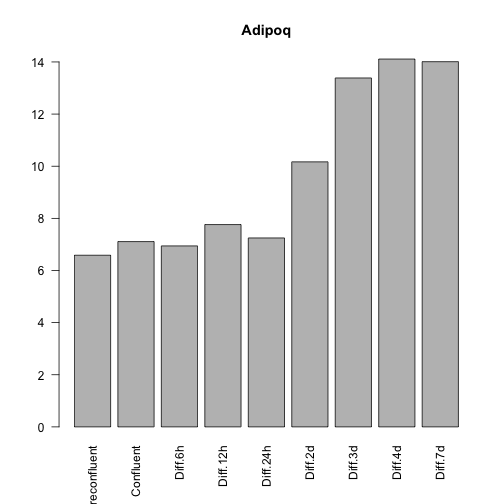
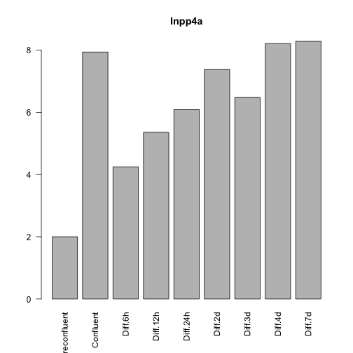
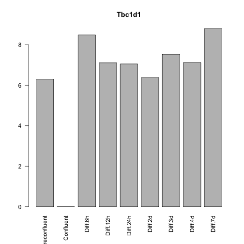
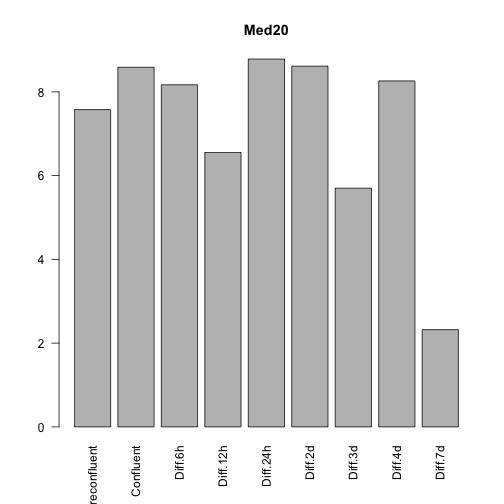
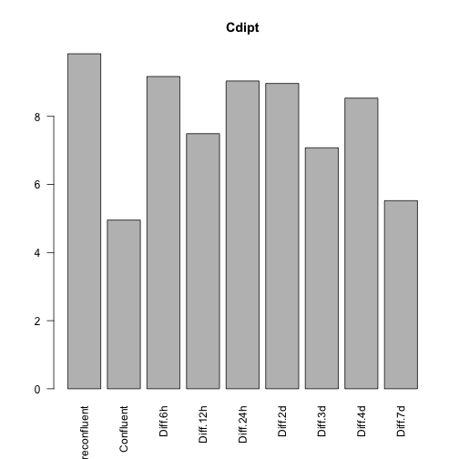

Systems Biology Analysis of 3T3-L1 Differentiation
========================================================

This was based on the tools learned about in the Coursera course.  This code was most recently run on Sun Oct 27 18:44:35 2013 and is stored at /Users/davebridges/Documents/Research/differentiation.  

Dataset Acquisition
--------------------


```
## Parsing....
```

This file was processed using R (<a href="http://www.R-project.org/"></a>) and knitr (<a href="http://yihui.name/knitr/">Andrew et al. 2013</a>; <a href="http://yihui.name/knitr/">Xie, 2013</a>; <a href="http://www.crcpress.com/product/isbn/9781466561595">Xie, 2013b</a>).


The data was obtained from GEO using the dataset in GEO accession GSE6794, which is described in (<a href="http://dx.doi.org/10.1016/j.cmet.2007.01.005">Cheung et al. 2007</a>).  This file is described as:

**3T3-L1 fibroblasts are a commonly used in vitro model for adipogenesis.  When induced with hormones, they differentiate into mature fat cells.  Here, microarrays were used to study 3T3-L1 adipose differentiation through time.**

The file was downloaded, annotated and reformatted into an input file for GATE (<a href="http://dx.doi.org/10.1093/bioinformatics/btp628">MacArthur et al. 2009</a>).  This file was saved as **Differentiation Time Course.clu**.  The file was downloades using bioMart (<a href="">Durinck et al. 2009</a>; <a href="">Durinck et al. 2005</a>).  The annotation was done using GEOquery (<a href="">Davis & Meltzer, 2007</a>).

Gene Expression Changes With Differentiation
---------------------------------------------


Time course dependent gene expression changes were done using limma (<a href="">Smyth, 2005</a>).


### Effects of Differentiation
<!-- html table generated in R 3.0.2 by xtable 1.7-1 package -->
<!-- Sun Oct 27 18:44:47 2013 -->
<TABLE border=1>
<TR> <TH>  </TH> <TH> Row.names </TH> <TH> logFC </TH> <TH> AveExpr </TH> <TH> t </TH> <TH> P.Value </TH> <TH> adj.P.Val </TH> <TH> B </TH> <TH> wikigene_name </TH>  </TR>
  <TR> <TD align="right"> 1 </TD> <TD> aa104750_at </TD> <TD align="right"> -6.27 </TD> <TD align="right"> 7.00 </TD> <TD align="right"> -7.15 </TD> <TD align="right"> 0.01 </TD> <TD align="right"> 1.00 </TD> <TD align="right"> -4.10 </TD> <TD> Med20 </TD> </TR>
  <TR> <TD align="right"> 2 </TD> <TD> aa511384_s_at </TD> <TD align="right"> 6.25 </TD> <TD align="right"> 7.40 </TD> <TD align="right"> 7.13 </TD> <TD align="right"> 0.01 </TD> <TD align="right"> 1.00 </TD> <TD align="right"> -4.10 </TD> <TD> D230025D16Rik </TD> </TR>
  <TR> <TD align="right"> 3 </TD> <TD> AA673251_rc_g_at </TD> <TD align="right"> 6.31 </TD> <TD align="right"> 7.20 </TD> <TD align="right"> 7.20 </TD> <TD align="right"> 0.01 </TD> <TD align="right"> 1.00 </TD> <TD align="right"> -4.10 </TD> <TD>  </TD> </TR>
  <TR> <TD align="right"> 4 </TD> <TD> AA673251_rc_g_at </TD> <TD align="right"> 6.31 </TD> <TD align="right"> 7.20 </TD> <TD align="right"> 7.20 </TD> <TD align="right"> 0.01 </TD> <TD align="right"> 1.00 </TD> <TD align="right"> -4.10 </TD> <TD> Dnajb9 </TD> </TR>
  <TR> <TD align="right"> 5 </TD> <TD> AFFX-PyruCarbMur/L09192_3_at </TD> <TD align="right"> 3.89 </TD> <TD align="right"> 11.43 </TD> <TD align="right"> 9.98 </TD> <TD align="right"> 0.00 </TD> <TD align="right"> 0.00 </TD> <TD align="right"> -0.84 </TD> <TD> Pcx </TD> </TR>
  <TR> <TD align="right"> 6 </TD> <TD> AFFX-PyruCarbMur/L09192_5_at </TD> <TD align="right"> 2.83 </TD> <TD align="right"> 8.88 </TD> <TD align="right"> 4.64 </TD> <TD align="right"> 0.00 </TD> <TD align="right"> 0.90 </TD> <TD align="right"> -2.30 </TD> <TD> Pcx </TD> </TR>
  <TR> <TD align="right"> 7 </TD> <TD> AFFX-PyruCarbMur/L09192_MA_at </TD> <TD align="right"> 2.34 </TD> <TD align="right"> 9.94 </TD> <TD align="right"> 4.16 </TD> <TD align="right"> 0.00 </TD> <TD align="right"> 1.00 </TD> <TD align="right"> -2.65 </TD> <TD> Pcx </TD> </TR>
  <TR> <TD align="right"> 8 </TD> <TD> c81115_rc_at </TD> <TD align="right"> 6.01 </TD> <TD align="right"> 5.69 </TD> <TD align="right"> 6.85 </TD> <TD align="right"> 0.01 </TD> <TD align="right"> 1.00 </TD> <TD align="right"> -4.10 </TD> <TD> Zc3h12c </TD> </TR>
  <TR> <TD align="right"> 9 </TD> <TD> U33005_s_at </TD> <TD align="right"> 8.80 </TD> <TD align="right"> 6.66 </TD> <TD align="right"> 10.04 </TD> <TD align="right"> 0.00 </TD> <TD align="right"> 1.00 </TD> <TD align="right"> -4.08 </TD> <TD> Tbc1d1 </TD> </TR>
  <TR> <TD align="right"> 10 </TD> <TD> U33005_s_at </TD> <TD align="right"> 8.80 </TD> <TD align="right"> 6.66 </TD> <TD align="right"> 10.04 </TD> <TD align="right"> 0.00 </TD> <TD align="right"> 1.00 </TD> <TD align="right"> -4.08 </TD> <TD> LOC100862515 </TD> </TR>
  <TR> <TD align="right"> 11 </TD> <TD> u37222_s_at </TD> <TD align="right"> 6.90 </TD> <TD align="right"> 10.16 </TD> <TD align="right"> 7.88 </TD> <TD align="right"> 0.01 </TD> <TD align="right"> 1.00 </TD> <TD align="right"> -4.09 </TD> <TD> Adipoq </TD> </TR>
  <TR> <TD align="right"> 12 </TD> <TD> U62483_s_at </TD> <TD align="right"> -6.06 </TD> <TD align="right"> 6.15 </TD> <TD align="right"> -6.91 </TD> <TD align="right"> 0.01 </TD> <TD align="right"> 1.00 </TD> <TD align="right"> -4.10 </TD> <TD> Ube2d2a </TD> </TR>
   </TABLE>


### Effects of Cellular Confluence
<!-- html table generated in R 3.0.2 by xtable 1.7-1 package -->
<!-- Sun Oct 27 18:44:47 2013 -->
<TABLE border=1>
<TR> <TH>  </TH> <TH> Row.names </TH> <TH> logFC </TH> <TH> AveExpr </TH> <TH> t </TH> <TH> P.Value </TH> <TH> adj.P.Val </TH> <TH> B </TH> <TH> wikigene_name </TH>  </TR>
  <TR> <TD align="right"> 1 </TD> <TD> aa027723_at </TD> <TD align="right"> -4.88 </TD> <TD align="right"> 7.78 </TD> <TD align="right"> -5.57 </TD> <TD align="right"> 0.02 </TD> <TD align="right"> 1.00 </TD> <TD align="right"> -4.58 </TD> <TD> Cdipt </TD> </TR>
  <TR> <TD align="right"> 2 </TD> <TD> AA168469_f_at </TD> <TD align="right"> 7.18 </TD> <TD align="right"> 7.88 </TD> <TD align="right"> 8.19 </TD> <TD align="right"> 0.01 </TD> <TD align="right"> 1.00 </TD> <TD align="right"> -4.58 </TD> <TD> Trafd1 </TD> </TR>
  <TR> <TD align="right"> 3 </TD> <TD> aa285553_s_at </TD> <TD align="right"> -5.09 </TD> <TD align="right"> 8.58 </TD> <TD align="right"> -5.81 </TD> <TD align="right"> 0.02 </TD> <TD align="right"> 1.00 </TD> <TD align="right"> -4.58 </TD> <TD> Lbr </TD> </TR>
  <TR> <TD align="right"> 4 </TD> <TD> aa693236_s_at </TD> <TD align="right"> -5.26 </TD> <TD align="right"> 6.49 </TD> <TD align="right"> -6.00 </TD> <TD align="right"> 0.01 </TD> <TD align="right"> 1.00 </TD> <TD align="right"> -4.58 </TD> <TD> Ndufaf4 </TD> </TR>
  <TR> <TD align="right"> 5 </TD> <TD> AFFX-PyruCarbMur/L09192_3_at </TD> <TD align="right"> 1.10 </TD> <TD align="right"> 11.43 </TD> <TD align="right"> 2.81 </TD> <TD align="right"> 0.02 </TD> <TD align="right"> 1.00 </TD> <TD align="right"> -4.54 </TD> <TD> Pcx </TD> </TR>
  <TR> <TD align="right"> 6 </TD> <TD> c81115_rc_at </TD> <TD align="right"> -4.83 </TD> <TD align="right"> 5.69 </TD> <TD align="right"> -5.51 </TD> <TD align="right"> 0.02 </TD> <TD align="right"> 1.00 </TD> <TD align="right"> -4.58 </TD> <TD> Zc3h12c </TD> </TR>
  <TR> <TD align="right"> 7 </TD> <TD> m98035_s_at </TD> <TD align="right"> 5.60 </TD> <TD align="right"> 8.64 </TD> <TD align="right"> 6.39 </TD> <TD align="right"> 0.01 </TD> <TD align="right"> 1.00 </TD> <TD align="right"> -4.58 </TD> <TD> Eif2b4 </TD> </TR>
  <TR> <TD align="right"> 8 </TD> <TD> R74740_rc_at </TD> <TD align="right"> 5.94 </TD> <TD align="right"> 6.33 </TD> <TD align="right"> 6.77 </TD> <TD align="right"> 0.01 </TD> <TD align="right"> 1.00 </TD> <TD align="right"> -4.58 </TD> <TD> Inpp4a </TD> </TR>
  <TR> <TD align="right"> 9 </TD> <TD> u19939_s_at </TD> <TD align="right"> 5.39 </TD> <TD align="right"> 6.91 </TD> <TD align="right"> 6.15 </TD> <TD align="right"> 0.01 </TD> <TD align="right"> 1.00 </TD> <TD align="right"> -4.58 </TD> <TD> Crhr2 </TD> </TR>
  <TR> <TD align="right"> 10 </TD> <TD> U33005_s_at </TD> <TD align="right"> -6.30 </TD> <TD align="right"> 6.66 </TD> <TD align="right"> -7.19 </TD> <TD align="right"> 0.01 </TD> <TD align="right"> 1.00 </TD> <TD align="right"> -4.58 </TD> <TD> LOC100862515 </TD> </TR>
  <TR> <TD align="right"> 11 </TD> <TD> U33005_s_at </TD> <TD align="right"> -6.30 </TD> <TD align="right"> 6.66 </TD> <TD align="right"> -7.19 </TD> <TD align="right"> 0.01 </TD> <TD align="right"> 1.00 </TD> <TD align="right"> -4.58 </TD> <TD> Tbc1d1 </TD> </TR>
   </TABLE>


### Some Sample Genes
     


Short Term Differentiation Dataset
-----------------------------------


These data were published in <a href="http://dx.doi.org/10.1186/1471-2199-13-9">Fromm-Dornieden et al. (2012)</a>.  We analysed the non-polysome bound mRNA fraction comparing undifferentiated to 3T3-L1 cells treated with DMI for 6h.  Output the significantly different genes into a text file named GSE29744 Significant Genes.txt.

<!-- html table generated in R 3.0.2 by xtable 1.7-1 package -->
<!-- Sun Oct 27 18:45:14 2013 -->
<TABLE border=1>
<TR> <TH>  </TH> <TH> ID </TH> <TH> adj.P.Val </TH> <TH> P.Value </TH> <TH> t </TH> <TH> B </TH> <TH> logFC </TH> <TH> Gene.symbol </TH> <TH> Gene.title </TH>  </TR>
  <TR> <TD align="right"> 2 </TD> <TD> A_51_P227090 </TD> <TD align="right"> 0.00 </TD> <TD align="right"> 0.00 </TD> <TD align="right"> 98.25 </TD> <TD align="right"> 24.52 </TD> <TD align="right"> 6.95 </TD> <TD> Ramp3 </TD> <TD> receptor (calcitonin) activity modifying protein 3 </TD> </TR>
  <TR> <TD align="right"> 1 </TD> <TD> A_51_P183571 </TD> <TD align="right"> 0.00 </TD> <TD align="right"> 0.00 </TD> <TD align="right"> 77.65 </TD> <TD align="right"> 23.13 </TD> <TD align="right"> 6.25 </TD> <TD> Serpine1 </TD> <TD> serine (or cysteine) peptidase inhibitor, clade E, member 1 </TD> </TR>
  <TR> <TD align="right"> 8 </TD> <TD> A_52_P266132 </TD> <TD align="right"> 0.00 </TD> <TD align="right"> 0.00 </TD> <TD align="right"> 76.08 </TD> <TD align="right"> 22.99 </TD> <TD align="right"> 7.19 </TD> <TD> Fgl2 </TD> <TD> fibrinogen-like protein 2 </TD> </TR>
  <TR> <TD align="right"> 4 </TD> <TD> A_51_P339793 </TD> <TD align="right"> 0.00 </TD> <TD align="right"> 0.00 </TD> <TD align="right"> 74.39 </TD> <TD align="right"> 22.84 </TD> <TD align="right"> 5.06 </TD> <TD> Il1rl1 </TD> <TD> interleukin 1 receptor-like 1 </TD> </TR>
  <TR> <TD align="right"> 9 </TD> <TD> A_52_P334562 </TD> <TD align="right"> 0.00 </TD> <TD align="right"> 0.00 </TD> <TD align="right"> 71.69 </TD> <TD align="right"> 22.59 </TD> <TD align="right"> 5.53 </TD> <TD> Vdr </TD> <TD> vitamin D receptor </TD> </TR>
  <TR> <TD align="right"> 3 </TD> <TD> A_51_P280455 </TD> <TD align="right"> 0.00 </TD> <TD align="right"> 0.00 </TD> <TD align="right"> 68.50 </TD> <TD align="right"> 22.28 </TD> <TD align="right"> 5.12 </TD> <TD> Prg4 </TD> <TD> proteoglycan 4 (megakaryocyte stimulating factor, articular superficial zone protein) </TD> </TR>
  <TR> <TD align="right"> 5 </TD> <TD> A_51_P384831 </TD> <TD align="right"> 0.00 </TD> <TD align="right"> 0.00 </TD> <TD align="right"> 68.03 </TD> <TD align="right"> 22.23 </TD> <TD align="right"> 5.08 </TD> <TD> Syt12 </TD> <TD> synaptotagmin XII </TD> </TR>
  <TR> <TD align="right"> 7 </TD> <TD> A_51_P489720 </TD> <TD align="right"> 0.00 </TD> <TD align="right"> 0.00 </TD> <TD align="right"> 66.62 </TD> <TD align="right"> 22.08 </TD> <TD align="right"> 5.98 </TD> <TD> Slc16a11 </TD> <TD> solute carrier family 16 (monocarboxylic acid transporters), member 11 </TD> </TR>
  <TR> <TD align="right"> 6 </TD> <TD> A_51_P449777 </TD> <TD align="right"> 0.00 </TD> <TD align="right"> 0.00 </TD> <TD align="right"> 65.61 </TD> <TD align="right"> 21.97 </TD> <TD align="right"> 4.86 </TD> <TD> Pmepa1 </TD> <TD> prostate transmembrane protein, androgen induced 1 </TD> </TR>
  <TR> <TD align="right"> 10 </TD> <TD> A_52_P488039 </TD> <TD align="right"> 0.00 </TD> <TD align="right"> 0.00 </TD> <TD align="right"> 65.08 </TD> <TD align="right"> 21.91 </TD> <TD align="right"> 4.62 </TD> <TD>  </TD> <TD>  </TD> </TR>
   </TABLE>


References
-----------


- Steffen Durinck, Paul Spellman, Ewan Birney, Wolfgang Huber,   (2009) Mapping identifiers for the integration of genomic datasets with the R/Bioconductor package biomaRt.  <em>Nature Protocols</em>  <strong>4</strong>  1184-1191
- Steffen Durinck, Yves Moreau, Arek Kasprzyk, Sean Davis, Bart  De Moor, Alvis Brazma, Wolfgang Huber,   (2005) BioMart and Bioconductor: a powerful link between biological databases and microarray data analysis.  <em>Bioinformatics</em>  <strong>21</strong>  3439-3440
- Kevin J. Cheung, Iphigenia Tzameli, Pavlos Pissios, Ilsa Rovira, Oksana Gavrilova, Toshio Ohtsubo, Zhu Chen, Toren Finkel, Jeffrey S. Flier, Jeffrey M. Friedman,   (2007) Xanthine Oxidoreductase is A Regulator of Adipogenesis And Pparγ Activity.  <em>Cell Metabolism</em>  <strong>5</strong>  115-128  <a href="http://dx.doi.org/10.1016/j.cmet.2007.01.005">10.1016/j.cmet.2007.01.005</a>
- Carolin Fromm-Dornieden, Silvia von der Heyde, Oleksandr Lytovchenko, Gabriela Salinas-Riester, Bertram Brenig, Tim Beissbarth, Bernhard G Baumgartner,   (2012) Novel Polysome Messages And Changes in Translational Activity Appear After Induction of Adipogenesis in 3t3-l1 Cells.  <em>Bmc Molecular Biology</em>  <strong>13</strong>  9-NA  <a href="http://dx.doi.org/10.1186/1471-2199-13-9">10.1186/1471-2199-13-9</a>
- Sean Davis, Paul Meltzer,   (2007) GEOquery: a bridge between the Gene Expression Omnibus (GEO) and BioConductor.  <em>Bioinformatics</em>  <strong>14</strong>  1846-1847
- Alastair Andrew, Alex Zvoleff, Brian Diggs, Cassio Pereira, Hadley Wickham, Heewon Jeon, Jeff Arnold, Jeremy Stephens, Jim Hester, Joe Cheng, Jonathan Keane, J.J. Allaire, Johan Toloe, Kohske Takahashi, Michel Kuhlmann, Nacho Caballero, Nick Salkowski, Noam Ross, Ramnath Vaidyanathan, Richard Cotton, Romain Francois, Sietse Brouwer, Simon Bernard, Taiyun Wei, Thibaut Lamadon, Tom Torsney-Weir, Trevor Davis, Weicheng Zhu, Wush Wu, Yihui Xie,   (2013) knitr: A general-purpose package for dynamic report generation in R.  <a href="http://yihui.name/knitr/">http://yihui.name/knitr/</a>
- Yihui Xie,   (2013) Dynamic Documents with {R} and knitr.  <a href="http://yihui.name/knitr/">http://yihui.name/knitr/</a>
- Yihui Xie,   (2013) knitr: A Comprehensive Tool for Reproducible Research in {R}.  <a href="http://www.crcpress.com/product/isbn/9781466561595">http://www.crcpress.com/product/isbn/9781466561595</a>
- Gordon Smyth,   (2005) Limma: linear models for microarray data.  397-420
- B. D. MacArthur, A. Lachmann, I. R. Lemischka, A. Ma'ayan,   (2009) Gate: Software For The Analysis And Visualization of High-Dimensional Time Series Expression Data.  <em>Bioinformatics</em>  <strong>26</strong>  143-144  <a href="http://dx.doi.org/10.1093/bioinformatics/btp628">10.1093/bioinformatics/btp628</a>
- R Core Team ,   (2013) R: A Language and Environment for Statistical Computing.  <a href="http://www.R-project.org/">http://www.R-project.org/</a>


Session Information
---------------------


```
## R version 3.0.2 (2013-09-25)
## Platform: x86_64-apple-darwin10.8.0 (64-bit)
## 
## locale:
## [1] en_US.UTF-8/en_US.UTF-8/en_US.UTF-8/C/en_US.UTF-8/en_US.UTF-8
## 
## attached base packages:
## [1] parallel  stats     graphics  grDevices utils     datasets  methods  
## [8] base     
## 
## other attached packages:
## [1] xtable_1.7-1        limma_3.18.1        biomaRt_2.18.0     
## [4] knitcitations_0.5-0 bibtex_0.3-6        GEOquery_2.28.0    
## [7] Biobase_2.22.0      BiocGenerics_0.8.0  knitr_1.5          
## 
## loaded via a namespace (and not attached):
## [1] digest_0.6.3   evaluate_0.5.1 formatR_0.9    httr_0.2      
## [5] RCurl_1.95-4.1 stringr_0.6.2  tools_3.0.2    XML_3.95-0.2
```

